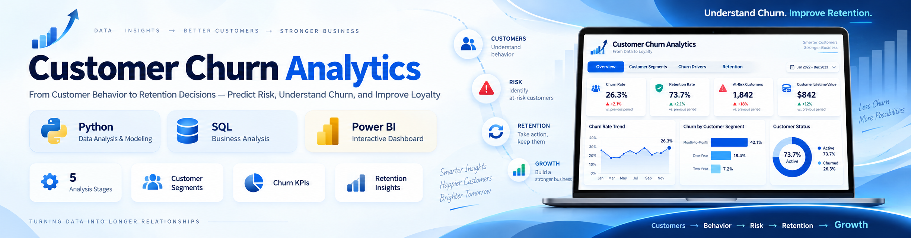
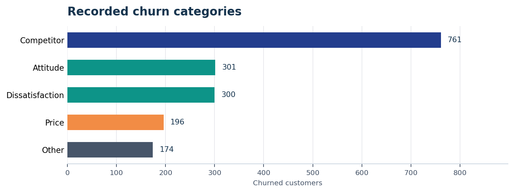
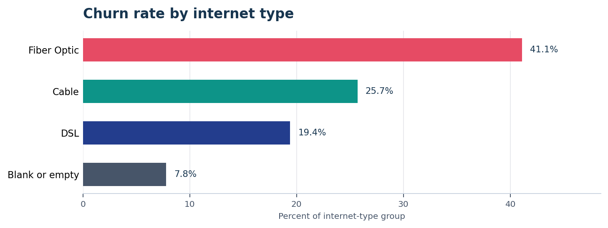
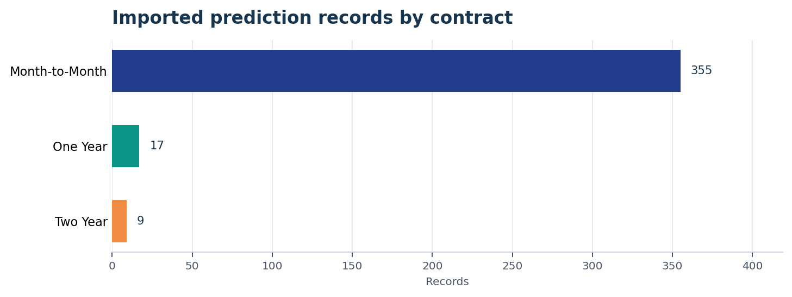

<p align="center">
  
</p>

<p align="center">
  <strong>End-to-end customer churn analytics using SQL, Power BI, Power Query, DAX, and Python to identify churn patterns, generate retention insights, and score newly joined customers with a Random Forest model.</strong>
</p>

<p align="center">
  
  
  
  
  
  
</p>

<p align="center">
  <a href="Dashboard/CHURN_ANALYSIS_projectdashboard.pdf">📊 Dashboard PDF</a> •
  <a href="Business_Report/Customer_Churn_Project_Report.pdf">📘 Business Report</a> •
  <a href="Python/Churn_Prediction_Random_Forest.ipynb">🤖 Python Model</a> •
  <a href="#-key-insights">💡 Key Insights</a>
</p>

---

| 👥 Customer Records | 🚪 Churned Customers | 📉 Churn Rate | ✨ New Joiners | 🔎 Prediction Records |
|---:|---:|---:|---:|---:|
| **6,418** | **1,732** | **27.0%** | **411** | **381** |

## 📊 Dashboard Experience

| Executive Summary | Prediction Review |
|---|---|
|  |  |
| KPIs, churn segments, reasons, contracts, services, and customer behavior | Flagged customers, demographic segments, filters, and customer-level details |

<p align="center">
  <a href="Dashboard/CHURN_ANALYSIS_projectdashboard.pdf"><strong>Open the complete two-page Power BI dashboard →</strong></a>
</p>

---

## 🧭 Project Overview

This project analyzes customer churn across **contract type, demographics, tenure, payment methods, internet services, service usage, and recorded churn reasons**.

The end-to-end analytics workflow combines:

**Data Cleaning → SQL / Power Query → Data Modeling → DAX → Power BI → Churn Analysis → Random Forest → Prediction Review**

The source dataset contains:

- **4,275 Stayed customers**
- **1,732 Churned customers**
- **411 Joined customers**

Historical **Stayed + Churned** customers are used for churn analysis and model training, while **Joined** customers are scored for potential churn.

The project combines descriptive analytics, dashboard development, SQL-based data preparation, and machine learning to support customer-retention analysis.

---

## 💡 Key Insights

### 📄 Month-to-Month Contracts Show the Highest Churn

Month-to-month customers show the strongest churn concentration, with a **46.5% churn rate**, compared with **11.0%** for one-year contracts and **2.7%** for two-year contracts.

| Contract | Customers | Churned | Churn Rate |
|---|---:|---:|---:|
| **Month-to-Month** | 3,286 | 1,529 | **46.5%** |
| One Year | 1,413 | 156 | 11.0% |
| Two Year | 1,719 | 47 | 2.7% |

**1,529 of 1,732 churned customers — 88.3% — are on month-to-month contracts.**

<p align="center">
  
</p>

---

### 🏁 Competitor-Related Reasons Lead Recorded Churn

**Competitor** is the largest recorded churn category with **761 customers**, representing **43.9% of churned customers**.

| Churn Category | Churned Customers | Share of Churn |
|---|---:|---:|
| **Competitor** | **761** | **43.9%** |
| Attitude | 301 | 17.4% |
| Dissatisfaction | 300 | 17.3% |
| Price | 196 | 11.3% |
| Other | 174 | 10.0% |

<p align="center">
  
</p>

This suggests that competitive positioning, pricing, service experience, and customer satisfaction are important areas for deeper retention analysis.

---

### 🌐 Fiber-Optic Customers Require Further Investigation

Fiber Optic customers show the highest descriptive churn rate.

| Internet Type | Churn Rate |
|---|---:|
| **Fiber Optic** | **41.1%** |
| Cable | 25.7% |
| DSL | 19.4% |
| Blank / No Internet Type | 7.8% |

<p align="center">
  
</p>

These rates describe associations in the dataset. Internet type should be analyzed together with contract type, tenure, customer demographics, pricing, and service mix before drawing business conclusions.

---

### 👥 Customer Demographics Add Additional Context

The dashboard shows that recorded churn is distributed:

- **64.1% Female**
- **35.9% Male**

Churn rates by age group are:

| Age Group | Churn Rate |
|---|---:|
| Under 20 | 23.1% |
| 20–35 | 23.5% |
| 35–50 | 24.0% |
| **Over 50** | **31.0%** |

The **over-50 customer segment** has the highest displayed churn rate among the age groups.

---

### 🧩 Service Usage Highlights Retention Opportunities

The service matrix evaluates the composition of services among churned customers.

Notable patterns include:

- **83.6%** of churned customers did not have Online Security.
- **82.4%** did not have Premium Support.
- **70.0%** did not have Online Backup.
- **69.1%** did not have a Device Protection Plan.
- **74.6%** used Paperless Billing.
- **85.5%** had Unlimited Data.

These patterns help identify customer-service combinations that may warrant deeper investigation.

---

### 🔎 Prediction Output Supports Targeted Customer Review

The prediction dataset contains **381 customer records flagged for churn review**.

Key characteristics include:

- **355 month-to-month customers — 93.2%**
- **247 female customers**
- **134 male customers**
- Age, tenure, payment method, contract, state, charges, revenue, refunds, and referral information

| Contract | Prediction Records | Share |
|---|---:|---:|
| **Month-to-Month** | **355** | **93.2%** |
| One Year | 17 | 4.5% |
| Two Year | 9 | 2.4% |

<p align="center">
  
</p>

The Power BI prediction page supports:

- Customer ID search
- Risk-status filtering
- Contract filtering
- Age analysis
- Tenure analysis
- Payment-method analysis
- State analysis
- Customer-level financial and referral review

---

## 🤖 Random Forest Churn Prediction

The Python component extends the descriptive BI analysis with a machine-learning workflow using:

**Python · pandas · NumPy · scikit-learn · Matplotlib · Seaborn · joblib**

### Workflow

1. Load `Dataset/Customer_Data.csv`.
2. Separate historical **Stayed / Churned** customers from **Joined** customers.
3. Remove customer ID and churn-reason fields from model features.
4. Encode categorical variables using `LabelEncoder`.
5. Encode the target variable:
   - `Stayed = 0`
   - `Churned = 1`
6. Split historical data into **80% training / 20% testing**.
7. Train a Random Forest classifier.
8. Generate test-set predictions.
9. Evaluate model performance using:
   - Confusion Matrix
   - Classification Report
   - Precision
   - Recall
   - F1 Score
10. Calculate and visualize feature importance.
11. Score newly joined customers.
12. Export customers predicted to churn to `Dataset/Predictions.csv`.

### Random Forest Configuration

```python
RandomForestClassifier(
    n_estimators=100,
    random_state=42
)
```

### Model Features

Categorical variables encoded for model training include:

- Gender
- Married
- State
- Value Deal
- Phone Service
- Multiple Lines
- Internet Service
- Internet Type
- Online Security
- Online Backup
- Device Protection Plan
- Premium Support
- Streaming TV
- Streaming Movies
- Streaming Music
- Unlimited Data
- Contract
- Paperless Billing
- Payment Method

The model also uses available numerical customer, tenure, billing, service, and revenue-related fields.

### Prediction Workflow

Historical customers are used for model development:

```text
Stayed + Churned
        ↓
Data Preparation
        ↓
Train / Test Split
        ↓
Random Forest
        ↓
Model Evaluation
        ↓
Feature Importance
```

Newly joined customers are then scored:

```text
Joined Customers
       ↓
Same Data Preparation
       ↓
Random Forest Model
       ↓
Predicted Churn Status
       ↓
Dataset/Predictions.csv
       ↓
Power BI Prediction Dashboard
```

---

## ⚙️ SQL & Data Preparation

The project demonstrates three different data-preparation approaches.

| Approach | Purpose |
|---|---|
| **SQL Server** | Staging, validation, cleaning, production table creation, and analytical views |
| **PostgreSQL** | Equivalent ETL and validation workflow using PostgreSQL syntax |
| **Power Query** | Direct CSV ingestion and transformation for Power BI |

### SQL Workflow

Both SQL implementations include:

- Raw-data staging
- Row-count validation
- Data exploration
- Missing-value analysis
- Data cleaning
- Categorical-value standardization
- Production-table creation
- Historical churn/stay views
- Joined-customer views
- Final data-quality validation

The workflows separate customers into:

- **Historical customers** — Stayed + Churned
- **New customers** — Joined

This structure supports both descriptive churn analysis and predictive modeling.

---

## 🧹 Data Cleaning & Transformation

Key transformations include:

- Data-type validation
- Missing-value handling
- Duplicate review
- Customer-status segmentation
- Age grouping
- Tenure grouping
- Charge-range grouping
- Service-column transformation
- Categorical-value standardization
- Analytical view creation
- Service unpivoting for Power BI analysis

The cleaned data is then used across SQL, Power BI, and Python to maintain a consistent analytical workflow.

---

## 📈 Power BI & DAX

The Power BI solution combines:

- Cleaned customer data
- Prediction records
- Service-level analysis
- Age-group mappings
- Tenure-group mappings
- DAX measures
- Interactive filtering

### Summary Dashboard

The Summary page includes:

- Total Customers
- New Joiners
- Total Churn
- Churn Rate
- Churn by Gender
- Churn by Age Group
- Churn by Contract
- Churn by Tenure
- Churn by State
- Churn by Payment Method
- Churn by Internet Type
- Churn Category analysis
- Service-level analysis
- Interactive slicers

### Prediction Dashboard

The Prediction page includes:

- Total prediction records
- Prediction records by Gender
- Prediction records by Age Group
- Prediction records by Tenure
- Prediction records by Contract
- Prediction records by State
- Prediction records by Payment Method
- Customer search
- Risk-status filtering
- Contract filtering
- Customer-level detail table

Customer-level fields include:

- Customer ID
- Monthly Charge
- Total Revenue
- Total Refunds
- Number of Referrals

---

## 🎯 Business Recommendations

### 1. Prioritize Month-to-Month Customers

Month-to-month customers account for the largest concentration of recorded churn.

Retention analysis should focus on this segment across:

- Tenure
- Service usage
- Internet type
- Customer age
- Payment method
- Churn reason

### 2. Investigate Competitive Churn

Competitor-related reasons represent the largest churn category.

Further analysis should evaluate whether these customers share common:

- Contract types
- Services
- Pricing characteristics
- Tenure levels
- Customer-experience patterns

### 3. Analyze Fiber-Optic Customer Experience

Fiber Optic customers have the highest descriptive churn rate.

Their customer journey should be analyzed alongside:

- Monthly charges
- Contract type
- Tenure
- Premium Support
- Online Security
- Other service combinations

### 4. Use Prediction Results for Retention Prioritization

The prediction workflow can support targeted customer review by identifying newly joined customers with patterns similar to historically churned customers.

Prediction output should be combined with business context before retention actions are taken.

### 5. Measure Retention Outcomes

Retention initiatives should include:

- Defined target segments
- Baseline churn measurements
- Intervention dates
- Observation periods
- Retention KPIs

This allows future analysis to measure whether retention strategies actually improve customer outcomes.

---

## 📁 Repository Structure

```text
customer-churn-retention-analytics/
│
├── README.md
│
├── Business_Report/
│   └── Customer_Churn_Project_Report.pdf
│
├── Dashboard/
│   └── CHURN_ANALYSIS_projectdashboard.pdf
│
├── Dataset/
│   ├── Customer_Data.csv
│   └── Predictions.csv
│
├── Img/
│   ├── customer_churn_banner.png
│   ├── churn-reasons.png
│   ├── contract-churn-rate.png
│   ├── internet-rate.png
│   ├── prediction-contract.png
│   ├── prediction-dashboard.png
│   └── summary-dashboard.png
│
├── Python/
│   ├── Churn_Prediction_Random_Forest.ipynb
│   └── README_Random_Forest.md
│
├── Sql/
│   ├── Customer_Churn_PostgreSQL.sql
│   ├── Customer_Churn_SQL_Server.sql
│   └── README_SQL_Data_Loading.md
│
└── docs/
```

---

## 📚 Project Documentation

| Resource | Description | Link |
|---|---|---|
| **Power BI Dashboard** | Two-page customer churn and prediction dashboard | [Open Dashboard](Dashboard/CHURN_ANALYSIS_projectdashboard.pdf) |
| **Business Report** | Business findings, KPI definitions, workflow, and recommendations | [Open Report](Business_Report/Customer_Churn_Project_Report.pdf) |
| **Random Forest Notebook** | Python preprocessing, model training, evaluation, feature importance, and prediction workflow | [Open Notebook](Python/Churn_Prediction_Random_Forest.ipynb) |
| **Python Guide** | Documentation for the Python churn-prediction workflow | [Open Guide](Python/README_Random_Forest.md) |
| **SQL Server Script** | SQL Server ETL, cleaning, validation, and analytical views | [Open SQL](Sql/Customer_Churn_SQL_Server.sql) |
| **PostgreSQL Script** | PostgreSQL ETL, cleaning, validation, and analytical views | [Open SQL](Sql/Customer_Churn_PostgreSQL.sql) |
| **SQL Data Loading Guide** | SQL Server, PostgreSQL, and Power Query workflow documentation | [Open Guide](Sql/README_SQL_Data_Loading.md) |
| **Customer Dataset** | Customer-level source dataset | [Open CSV](Dataset/Customer_Data.csv) |
| **Prediction Output** | Customers flagged by the prediction workflow | [Open CSV](Dataset/Predictions.csv) |


<p align="center">
  <strong>Customer Churn &amp; Retention Intelligence</strong>
</p>

<p align="center">
  <sub>Power BI · SQL Server · PostgreSQL · Python · Machine Learning · Power Query · DAX · Business Analytics</sub>
</p>

<p align="center">
  <strong>Subachan Subedi</strong>
</p>
