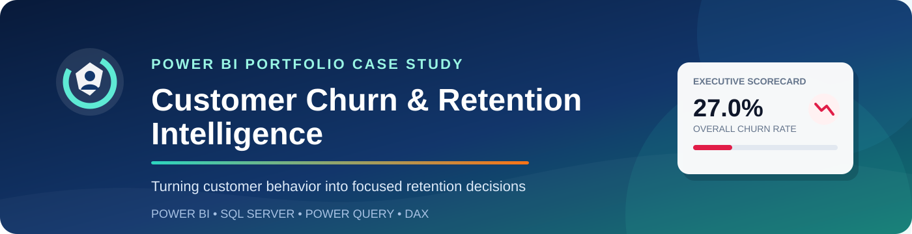
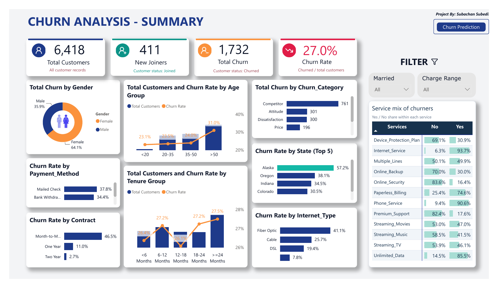
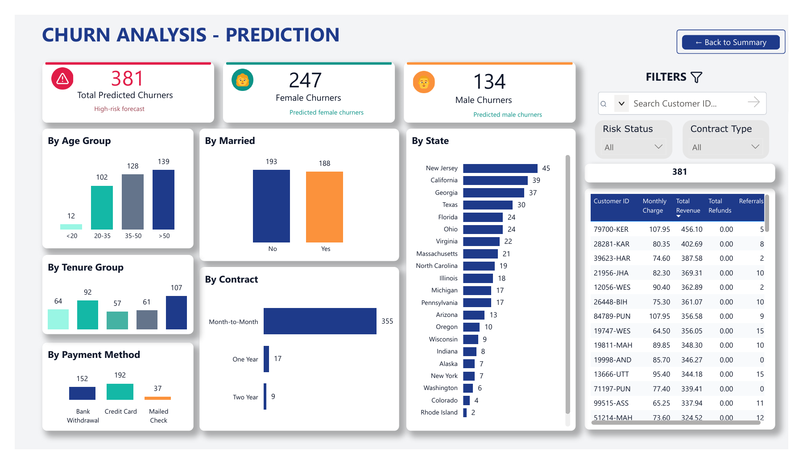
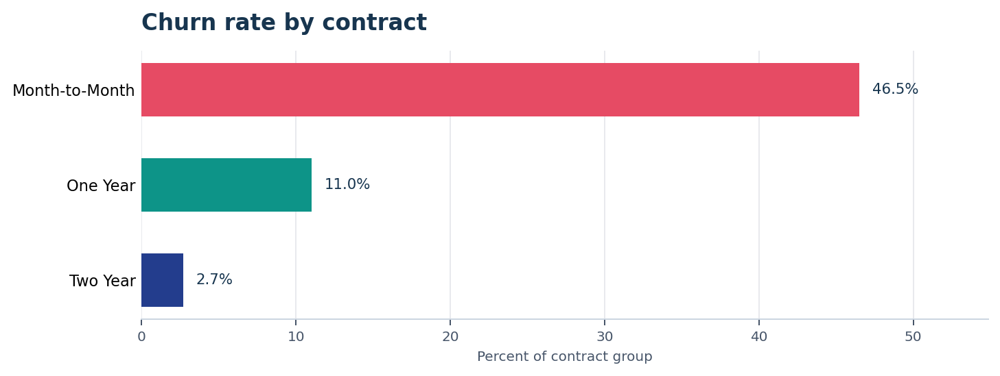
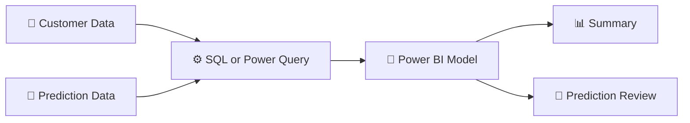

<p align="center">
  
</p>

<p align="center">
  <strong>A business intelligence case study that turns customer behavior, service usage and churn records into focused retention decisions.</strong>
</p>

<p align="center">
  
  
  
  
  
</p>

<p align="center">
  <a href="Dashboard/CHURN_ANALYSIS_project-dashboard.pdf">📊 Dashboard PDF</a> •
  <a href="Business_Report/Customer_Churn_Project_Report.pdf">📘 Business Report</a> •
  <a href="#key-insights">💡 Key Insights</a> •
  <a href="#technical-implementation">⚙️ Technical Build</a> •
  <a href="#business-recommendations">🎯 Recommendations</a>
</p>

---

<table>
  <tr>
    <td align="center" width="20%"><strong>👥 6,418</strong><br><sub>Customer Records</sub></td>
    <td align="center" width="20%"><strong>🚪 1,732</strong><br><sub>Churned Customers</sub></td>
    <td align="center" width="20%"><strong>📉 27.0%</strong><br><sub>Overall Churn Rate</sub></td>
    <td align="center" width="20%"><strong>✨ 411</strong><br><sub>New Joiners</sub></td>
    <td align="center" width="20%"><strong>🔎 381</strong><br><sub>Prediction Records</sub></td>
  </tr>
</table>

## 📊 Dashboard Experience

<table>
  <tr>
    <td width="50%"><a href="Dashboard/CHURN_ANALYSIS_project-dashboard.pdf"></a></td>
    <td width="50%"><a href="Dashboard/CHURN_ANALYSIS_project-dashboard.pdf"></a></td>
  </tr>
  <tr>
    <td align="center"><strong>Executive Summary</strong><br><sub>KPIs, churn segments, reasons and service patterns</sub></td>
    <td align="center"><strong>Prediction Review</strong><br><sub>Flagged-customer segments, filters and record detail</sub></td>
  </tr>
</table>

<p align="center"><a href="Dashboard/CHURN_ANALYSIS_project-dashboard.pdf"><strong>Open the complete two-page dashboard PDF →</strong></a></p>

> [!NOTE]
> The public repository presents the completed dashboard through screenshots and a PDF export. The interactive PBIX file and source datasets are not distributed.

## 🧭 Executive Snapshot

Customer churn affects the size and stability of the active customer base. This project organizes customer, contract, service and churn-reason data into a two-page Power BI dashboard designed to answer three practical questions:

1. Where is recorded churn concentrated?
2. Which customer segments should be investigated first?
3. Which imported prediction records require customer-level review?

The analysis identifies contract structure, recorded competitor-related reasons and fiber-optic service as important areas for further retention investigation. Findings are descriptive and should be interpreted together with the limitations documented below and in the full [business report](Business_Report/Customer_Churn_Project_Report.pdf).

<a id="key-insights"></a>

## 💡 Key Insights

### 📄 Month-to-month contracts define the clearest retention priority

Month-to-month customers have a **46.5% churn rate**, compared with **11.0%** for one-year contracts and **2.7%** for two-year contracts. This segment contains **1,529 of 1,732 churned customers**, representing **88.3% of all recorded churn**.

| Contract | Customers | Churned | Churn rate |
|---|---:|---:|---:|
| **Month-to-Month** | 3,286 | 1,529 | **46.5%** |
| One Year | 1,413 | 156 | 11.0% |
| Two Year | 1,719 | 47 | 2.7% |

<p align="center"></p>

### 🏁 Recorded reasons point to competitive pressure

**Competitor** is the largest recorded churn category with **761 customers**, accounting for **43.9% of churned customers**. Attitude accounts for 301 records, dissatisfaction for 300, price for 196 and other reasons for 174.

### 🌐 Fiber-optic service warrants deeper investigation

Fiber Optic has a **41.1% descriptive churn rate**, compared with **25.7%** for Cable and **19.4%** for DSL. Contract type, tenure and other customer characteristics may overlap with internet type, so this pattern should not be interpreted as causal.

### 🔎 The imported prediction list is highly concentrated

The Prediction page contains **381 records**: 247 female and 134 male customers. **355 records, or 93.2%, are month-to-month customers.** The dashboard provides customer search, contract filtering and customer-level fields to support review.

<a id="business-recommendations"></a>

## 🎯 Business Recommendations

| Priority | Recommended action | Management purpose |
|---|---|---|
| **1 — Contract retention** | Analyze month-to-month churn by service, tenure and recorded reason before choosing an intervention. | Focus investigation on the largest churn concentration. |
| **2 — Competitive review** | Review competitor-related churn records alongside available service and customer characteristics. | Identify recurring themes that may require a commercial or experience response. |
| **3 — Service investigation** | Examine the fiber-optic customer journey and compare it with other internet types. | Understand the descriptive churn gap before acting. |
| **4 — Measurement** | Define a baseline, target group and observation period for any retention test. | Separate measured outcomes from assumptions. |
| **5 — Prediction governance** | Document the scoring method, scoring date, forecast horizon and evaluation results before automated use. | Ensure the imported prediction list is applied responsibly. |

## 🧠 Analytical Approach

The project combines business analysis, data preparation, semantic modeling and dashboard design:



| Model object | Purpose | Verified detail |
|---|---|---|
| `prod_Churn` | Main customer analysis | 6,418 rows with unique customer IDs |
| `Predictions` | Imported prediction records | 381 rows with unique customer IDs |
| `prod_Services` | Unpivoted service analysis | 77,016 rows from 12 service indicators |
| `mapping_AgeGrp` | Age grouping and sorting | Active relationship to the customer table |
| `mapping_TenureGrp` | Tenure grouping and sorting | Active relationship to the customer table |
| `tbl_Measures` | Central DAX measure table | Six measures |

The model includes measures for total customers, new joiners, total churn, churn rate and prediction counts. The relationship between `Predictions` and `prod_Churn` is active, one-to-one and bidirectional through `Customer_ID`.

<a id="technical-implementation"></a>

## ⚙️ Technical Implementation

The reporting objective can be implemented through either SQL Server or direct CSV ingestion with Power Query.

<details>
<summary><strong>🗄️ SQL Server implementation route</strong></summary>

<br>

1. Import the customer CSV into a staging table named `stg_Churn`.
2. Validate distributions, expected values, data types and missing values.
3. Create the cleaned `prod_Churn` table and apply documented missing-value defaults.
4. Create `vw_ChurnData` for Churned and Stayed customers.
5. Create `vw_JoinData` for Joined customers.
6. Connect Power BI to the SQL Server views and configure refresh.

</details>

<details>
<summary><strong>📄 CSV and Power Query implementation route</strong></summary>

<br>

1. Connect Power BI directly to the customer and prediction CSV files.
2. Promote headers and assign the required column data types.
3. Standardize missing values using the same business rules as the SQL workflow.
4. Create the age, tenure and service transformations in Power Query.
5. Load the prepared analytical tables into the Power BI model.
6. Refresh from the configured local or managed file locations.

</details>

The documented solution demonstrates both routes. Detailed transformation logic, model relationships, calculations and refresh steps are available in the [project report](Business_Report/Customer_Churn_Project_Report.pdf).

## 🖥️ Dashboard Capabilities

- Executive KPI cards for customer volume and recorded churn
- Contract, age, tenure, gender, payment, internet-type and churn-reason analysis
- Service composition matrix with in-cell data bars
- Married and charge-range slicers on the Summary page
- Customer search, risk-status and contract filters on the Prediction page
- Detail table containing charges, revenue, refunds and referrals
- Page navigation between Summary and Prediction views

## 💼 Project Value

This project demonstrates the ability to:

- Translate a customer-retention problem into measurable analytical questions
- Prepare data through both SQL Server and Power Query
- Build reusable DAX measures and business groupings
- Design an executive-level Power BI dashboard
- Turn dashboard findings into practical management recommendations
- Interpret descriptive patterns without overstating causation
- Document a BI solution for both management and technical audiences

## ⚠️ Interpretation and Limitations

- The overall churn rate uses all 6,418 customer records as its denominator, including 411 new joiners.
- The service matrix describes the Yes and No composition of churned customers; it does not measure churn probability among all service users.
- The prediction list is imported. The supplied project materials do not include training code, probabilities, a forecast horizon or model-evaluation results.
- Revenue fields exist, but the project does not establish currency, profit, campaign return or revenue saved.
- The findings describe associations in the imported records and do not establish causation.

## 📁 Repository Structure

```text
customer-churn-retention-analytics/
├── README.md
├── Python/
│   ├── README_Random_Forest.md
│   └── Churn_Prediction_Random_Forest.ipynb
├── Dataset/
│   ├── Customer_Data.csv
│   └── Predictions.csv
├── Sql/
│   ├── Customer_Churn_PostgreSQL.sql
│   ├── Customer_Churn_SQL_Server.sql
│   └── README_SQL_Data_Loading.md
├── Dashboard/
│   └── CHURN_ANALYSIS_projectdashboard.pdf
├── Business_Report/
│   └── Customer_Churn_Project_Report.pdf
└── Img/
    ├── churn-reasons.png
    ├── contract-churn-rate.png
    ├── customer-churn-hero.svg
    ├── internet-rate.png
    ├── prediction-contract.png
    ├── prediction-dashboard.png
    ├── solution-flow.png
    └── summary-dashboard.png
```

## 📚 Project Documentation

| Resource | Description | Link |
|---|---|---|
| **Dashboard PDF** | Static export of the Summary and Prediction dashboard pages | [Open PDF](Dashboard/CHURN_ANALYSIS_project-dashboard.pdf) |
| **Business report** | Management findings, KPI definitions, data architecture, SQL and CSV workflows, calculations, limitations and refresh guidance | [Open report](Business_Report/Customer_Churn_Project_Report.pdf) |

---

<div align="center">

### Customer Churn & Retention Intelligence

**Designed and developed by Subachan Subedi**

<sub>Power BI · SQL Server · Power Query · DAX · Business Intelligence</sub>

</div>

